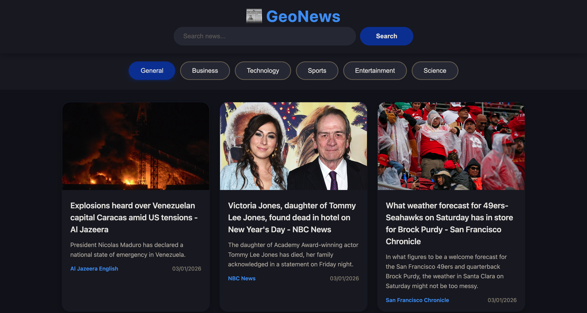

# 📰 GeoNews

A modern, responsive news web application that fetches and displays the latest news from around the world using the News API.

## Screenshots



## Features

- **Real-time News**: Fetches the latest headlines from trusted news sources
- **Category Filtering**: Browse news by categories (General, Business, Technology, Sports, Entertainment, Science)
- **Search Functionality**: Search for specific topics or keywords
- **Responsive Design**: Works seamlessly on desktop, tablet, and mobile devices
- **Dark Theme**: Modern dark UI with smooth animations and hover effects
- **Click to Read**: Click any news card to open the full article in a new tab

## Technologies Used

- HTML5
- CSS3
- JavaScript (ES6+)
- News API

## Installation

1. Clone or download this repository
2. Ensure all three files are in the same directory:
   - `index.html`
   - `style.css`
   - `app.js`
3. Open `index.html` in your web browser

## File Structure
```
GeoNews/
│
├── index.html          # Main HTML structure
├── style.css           # All styling and design
└── app.js              # JavaScript functionality and API calls
```

## API Configuration

The app uses News API with the following configuration:
- API Key: `54be8b662d1445918b5942b5bc08169c`
- Base URL: `https://newsapi.org/v2`
- Country: US
- Page Size: 20 articles per request

## Usage

1. **Browse by Category**: Click on any category button (General, Business, Technology, etc.) to view news from that category
2. **Search News**: Type keywords in the search bar and click "Search" or press Enter
3. **Read Articles**: Click on any news card to open the full article in a new tab

## Features in Detail

### Search Bar
- Real-time search functionality
- Enter key support for quick searches
- Searches across all news sources globally

### Category Filtering
- 6 main categories available
- Active category is highlighted in blue
- Smooth transitions between categories

### News Cards
- Display article image, title, description
- Show news source and publication date
- Hover effects for better UX
- Fallback for missing images

### Error Handling
- Network error detection
- Empty results notification
- Loading indicators during API calls

## Browser Support

- Chrome (recommended)
- Firefox
- Safari
- Edge
- Opera

## Limitations

- News API free tier has request limits (100 requests per day)
- Some articles may be removed or unavailable
- Images may occasionally be missing from certain sources

## Design Highlights

- **Color Scheme**: Dark theme with blue accents (#4285f4)
- **Typography**: System fonts for optimal performance
- **Layout**: CSS Grid for responsive card layout
- **Animations**: Smooth hover effects and transitions
- **Accessibility**: High contrast and readable fonts

## Future Enhancements

- Add pagination for more articles
- Implement bookmarking/favorites
- Add dark/light theme toggle
- Include more countries and languages
- Add article filtering by date
- Implement infinite scroll

## Credits

- News data provided by [News API](https://newsapi.org/)
- Developed by [Sahul Kumar/Gitey007]

## License

This project is open source and available for educational purposes.

## Support

For issues or questions, please check the News API documentation at https://newsapi.org/docs

---

**Note**: This application requires an active internet connection to fetch news articles.